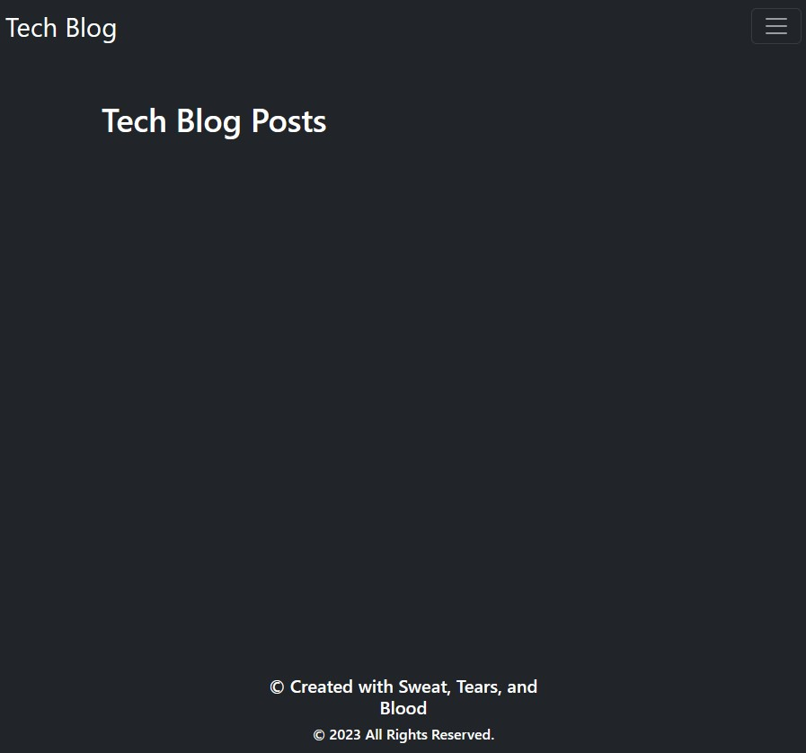

# MVC Tech Blog

A Heroku deployed application designed for people to blog, mostly about technology. Users are able to comment, post and engage with each other on the blog through posts or comments as of the current patch. This application uses Handlebars.js as the template langauge and uses Sequelize as the ORM.

## Deployed Website

[Heroku Application](https://aqueous-wave-99817-f8310cd24d7c.herokuapp.com/)

## Built With

- JSON
- Node.js
- Express.js
- Bcryptjs
- Dotenv
- Express Handlebars
- Sequelize
- MySQL2

## License

 [Open Source Initiative Link](https://opensource.org/licenses/MIT)

Please refer to the Repo.
